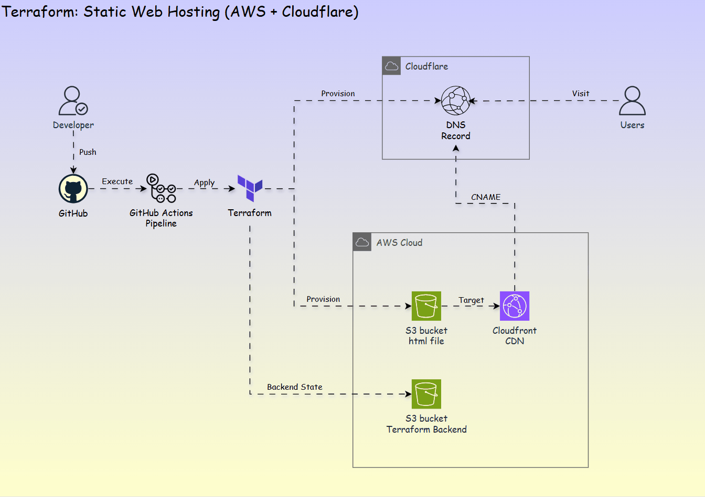
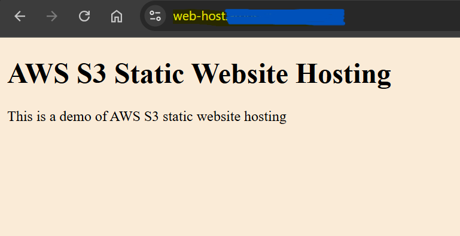

# Terraform Project: Enable Static Website Hosting on AWS S3

An `Infrastructure as Code (IaC)` solution to host a static website on `AWS S3` and update `Cloudflare` domain settings using `Terraform`.



---

## Prerequisites

- AWS CLI access key with appropriate permissions.
- Cloudflare API token for DNS management.

---

## Usage

1. Configure AWS CLI

```sh
aws configure
```

2. Create configuration file `state.config` and add variables. See example file: `terraform/state.config.example`

| Variable | Description                                              |
| -------- | -------------------------------------------------------- |
| `bucket` | S3 bucket name for storing Terraform state (pre-created) |
| `key`    | S3 object key for the state file                         |
| `region` | AWS region where the state bucket is located             |

3. Initialize Terraform

```sh
cd terraform
terraform init -backend-config="./state.config" -migrate-state
```

4. Create and input variables in `terraform.tfvars`. See example file: `terraform/terraform.tfvars.example`

| Variable               | Description                            |
| ---------------------- | -------------------------------------- |
| `app_name`             | Application name.                      |
| `web_domain`           | Static web domain name.                |
| `web_subdomain`        | Static web subdomain name.             |
| `aws_region`           | AWS region to provision resources.     |
| `aws_acm_cert_arn`     | AWS acm certificate arn.               |
| `cloudflare_api_token` | Cloudflare API Token.                  |
| `cloudflare_zone_id`   | Cloudflare zone id of the domain name. |

1. Create website in `web` directory

Place static website files (HTML, CSS, JS) in the web/ directory at the project root.

6. Deploy website

```sh
# Plan and review changes
terraform plan

# Apply infrastructure changes
terraform apply -auto-approve

# Destroy infrastructure when no longer needed
terraform destroy -auto-approve
```

---

## How does it work?

1. **Create S3 Bucket**: Provision an AWS S3 bucket configured for static website hosting.

2. **Upload Static Website Files**: Use Terraform to upload required static files to the S3 bucket.

3. **Enable Static Website Hosting**: Configure the S3 bucket for static website hosting.

4. **Configure Bucket Policy**: Define access policies to control permissions for the S3 bucket.

5. **Update DNS with Cloudflare**



---

## Benefit

- **Automation**

Simplifies infrastructure deployment through **automated workflows**, minimizing manual effort and ensuring uniformity **across environments**.

- **Ease of Use**

Requires only `AWS` and `Cloudflare` access, with **customization** of web hosting requiring just four arguments.

---

## Advanced - GitHub Actions

### Configure Variable

- Terraform S3 Backend Configuration

| Variable                    | Description                              |
| --------------------------- | ---------------------------------------- |
| `AWS_BACKEND_BUCKET`        | S3 bucket name for Terraform state       |
| `AWS_BACKEND_BUCKET_KEY`    | S3 key path for state file storage       |
| `AWS_BACKEND_BUCKET_REGION` | AWS region of the Terraform state bucket |

- Provider Configuration

| Variable                | Description                                |
| ----------------------- | ------------------------------------------ |
| `AWS_ACCESS_KEY_ID`     | AWS access key ID for Terraform operations |
| `AWS_SECRET_ACCESS_KEY` | AWS secret access key                      |
| `AWS_REGION`            | Default AWS region for resource creation   |
| `CLOUDFLARE_API_TOKEN`  | Cloudflare API token with Zone:Edit perms  |
| `CLOUDFLARE_ZONE_ID`    | Cloudflare zone ID for DNS management      |

- Application Configuration

| Variable           | Description                               |
| ------------------ | ----------------------------------------- |
| `APP_NAME`         | Application name used as subdomain prefix |
| `APP_DOMAIN`       | Domain name for the website               |
| `APP_SUBDOMAIN`    | Subomain name for the website             |
| `AWS_ACM_CERT_ARN` | AWS ACM certificate arn                   |

- Key command:

```sh
terraform init \
  -backend-config="bucket=${{ secrets.AWS_BACKEND_BUCKET }}" \
  -backend-config="key=${{ secrets.AWS_BACKEND_BUCKET_KEY }}" \
  -backend-config="region=${{ secrets.AWS_BACKEND_BUCKET_REGION }}" \
  -backend-config="encrypt=true"
```

---

### Resource Control

Control Terraform operations using the `.terraform.ini` file.

| File content | Description                             | Action Taken        |
| ------------ | --------------------------------------- | ------------------- |
| `apply`      | Deploy/update infrastructure resources  | `terraform apply`   |
| `destroy`    | Remove all provisioned infrastructure   | `terraform destroy` |
| Any other    | Invalid - workflow will fail with error | No action           |
