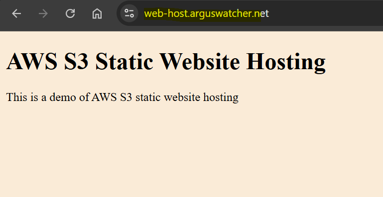

# Terraform Project: Enable Static Website Hosting on AWS S3

An **Infrastructure as Code (IaC)** solution to host a static website on **AWS S3** and update **Cloudflare** domain settings using Terraform.

---

## Prerequisites

- AWS CLI access key with appropriate permissions.
- Cloudflare API token for DNS management.

---

## Usage

1. Configure AWS CLI

```sh
aws configure
```

2. Create configuration file `state.config` and add variables

| Variable | Description                  |
| -------- | ---------------------------- |
| `bucket` | S3 bucket name for backend   |
| `key`    | S3 bucket key for backend    |
| `region` | S3 bucket region for backend |

3. Initialize Terraform

```sh
cd terraform
terraform init -backend-config="./state.config"
```

4. Create and input variables in `terraform.tfvars`

| Variable               | Description                                    |
| ---------------------- | ---------------------------------------------- |
| `app_name`             | Application name, also used as subdomain name. |
| `domain_name`          | Domain name hosted on Cloudflare.              |
| `aws_region`           | AWS region to provision resources.             |
| `cloudflare_api_token` | Cloudflare API Token.                          |
| `cloudflare_zone_id`   | Cloudflare zone id of the domain name.         |

5. Create website in `web` directory

6. Deploy website

```sh
# apply with env var
terraform apply -auto-approve

# destroy
terraform destroy -auto-approve
```

---

## How does it work?

1. **Create S3 Bucket**: Provision an AWS S3 bucket configured for static website hosting.

2. **Upload Static Website Files**: Use Terraform to upload required static files to the S3 bucket.

3. **Enable Static Website Hosting**: Configure the S3 bucket for static website hosting.

4. **Configure Bucket Policy**: Define access policies to control permissions for the S3 bucket.

5. **Update DNS with Cloudflare**



---

## Benefit

- **Automation**

Simplifies infrastructure deployment through **automated workflows**, minimizing manual effort and ensuring uniformity **across environments**.

- **Ease of Use**

Requires only `AWS` and `Cloudflare` access, with **customization** of web hosting requiring just four arguments.

---

## Advanced - GitHub Actions

- Configure variable for Provider

| Variable                | Description |
| ----------------------- | ----------- |
| `AWS_ACCESS_KEY_ID`     |             |
| `AWS_SECRET_ACCESS_KEY` |             |
| `AWS_REGION`            |             |
| `CLOUDFLARE_API_TOKEN`  |             |
| `CLOUDFLARE_ZONE_ID`    |             |

- Configure variable for Terraform S3 backend

| Variable                    | Description |
| --------------------------- | ----------- |
| `AWS_BACKEND_BUCKET`        |             |
| `AWS_BACKEND_BUCKET_KEY`    |             |
| `AWS_BACKEND_BUCKET_REGION` |             |

- Configure variable for Application

| Variable          | Description |
| ----------------- | ----------- |
| `APP_NAME`        |             |
| `APP_DOMAIN_NAME` |             |

- Key command:

```sh
terraform init \
  -backend-config="bucket=${{ secrets.AWS_BACKEND_BUCKET }}" \
  -backend-config="key=${{ secrets.AWS_BACKEND_BUCKET_KEY }}" \
  -backend-config="region=${{ secrets.AWS_BACKEND_BUCKET_REGION }}" \
  -backend-config="encrypt=true"
```
