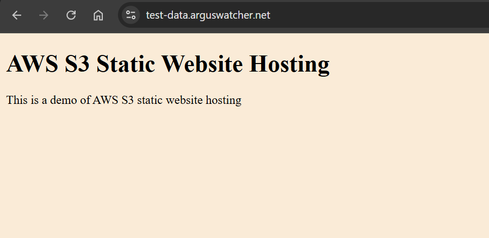

# Terraform Project: Enable Static Website Hosting on AWS S3

An **Infrastructure as Code (IaC)** solution to host a static website on **AWS S3** and update **Cloudflare** domain settings using Terraform.

---

## Prerequisites

- AWS CLI access key with appropriate permissions.
- Cloudflare API token for DNS management.

---

## Usage

1. Configure AWS CLI and Initialize Terraform

```sh
aws configure

terraform init
```

2. Update Variables in `tf_variable.tf`

| Variable               | Description                                 |
| ---------------------- | ------------------------------------------- |
| `web_domain_name`      | Main domain name for DNS records.           |
| `sub_domain_name`      | Sub-domain name for hosting purposes.       |
| `aws_region`           | AWS region where S3 bucket will be created. |
| `cloudflare_api_token` | Token for Cloudflare API access.            |
| `cloudflare_zone_id`   | The Cloudflare zone id.                     |

1. Apply

```sh
# apply with env var
terraform apply -var-file="terraform.tfvars" -auto-approve

terraform destroy -var-file="terraform.tfvars" -auto-approve
```

---

## How does it work?

1. **Create S3 Bucket**: Provision an AWS S3 bucket configured for static website hosting.

2. **Upload Static Website Files**: Use Terraform to upload required static files to the S3 bucket.

3. **Enable Static Website Hosting**: Configure the S3 bucket for static website hosting.

4. **Configure Bucket Policy**: Define access policies to control permissions for the S3 bucket.

5. **Update DNS with Cloudflare**



---

## Benefit

- **Automation**

Simplifies infrastructure deployment through **automated workflows**, minimizing manual effort and ensuring uniformity **across environments**.

- **Ease of Use**

Requires only `AWS` and `Cloudflare` access, with **customization** of web hosting requiring just four arguments.
